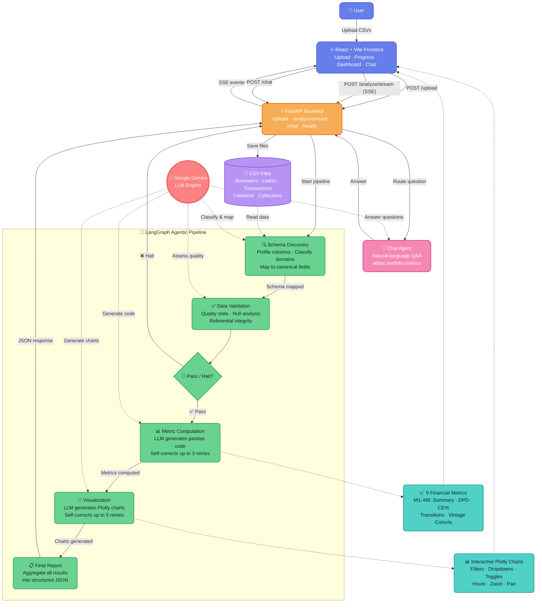
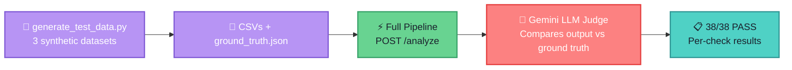

# Fintech-Agent — AI-Powered Loan Portfolio Analytics Dashboard

A full-stack agentic application that autonomously analyses loan portfolio CSV data from Indian NBFCs. Upload CSVs through a React web UI, watch real-time agent progress via Server-Sent Events, and get computed financial metrics with interactive Plotly charts — all powered by **Google Gemini + LangGraph**.

## What It Does

1. **Upload CSVs** via the React frontend (drag-and-drop or file picker)
2. **AI agents** autonomously discover file schemas, validate data quality, compute financial metrics, and generate visualisations — no manual column mapping needed
3. **Real-time progress** is streamed to the browser as each agent stage completes
4. **Results dashboard** displays computed metrics and interactive Plotly charts with filters, time-window selectors, and cohort controls
5. **Chat agent** lets you ask natural-language questions about the analysed portfolio data

## System Architecture



### Agent Nodes

| Agent | What it does |
|-------|-------------|
| **🔍 Schema Discovery** | Scans uploaded CSVs, profiles columns/dtypes/nulls, uses Gemini to classify file domains (loan/txn/borrower/collateral/collections) and map columns to canonical fields |
| **✅ Data Validation** | Loads full CSVs, computes quality stats (nulls, ranges, referential integrity); Gemini assesses pass / warn / halt |
| **📊 Metric Computation** | Gemini generates pandas code per metric; code executes on live DataFrames; self-corrects on failure (up to 3 retries) |
| **🎨 Visualization** | Gemini generates interactive Plotly chart code per metric; self-corrects on rendering errors (up to 5 retries) |
| **💬 Chat Agent** | Answers natural-language questions about computed metrics using full portfolio context |

## Supported Metrics

| ID | Metric | Chart Type | Interactive Controls |
|----|--------|------------|---------------------|
| M1 | Portfolio Summary — POS, active count, weighted avg rate & tenor | KPI Table | — |
| M2 | POS Distribution by DPD Bucket | Horizontal Bar | Hover, zoom |
| M3 | Collections Efficiency Time Series | Line + Area | Monthly/Quarterly toggle |
| M4 | CE% by DPD Bucket | Vertical Bar | Month selector dropdown |
| M5 | POS Transition Matrix (₹ Cr) | Heatmap | Period selector dropdown |
| M6 | POS Transition Matrix (%) | Heatmap | Period selector dropdown |
| M7 | Loan Count Transition Matrix | Heatmap | Period selector dropdown |
| M8 | Loan Count Transition Matrix (%) | Heatmap | Period selector dropdown |
| M9 | Vintage Cohort Repayment Curves | Multi-line | Cohort selector (All/Last 4/Last 8) |

> The LLM decides which metrics are feasible based on the files and columns you provide. Non-computable metrics are skipped with a reason.

## Key Features

- **Schema-agnostic**: Handles any CSV structure — the AI maps columns dynamically
- **Two datasets tested**: Medium (84K loans, 2.3M transactions, 5 files) and Large (3 files, different schema) — both work without code changes
- **Interactive charts**: All visualisations include Plotly interactivity — hover tooltips, zoom, pan, dropdown selectors, toggle buttons
- **Chat Q&A**: Ask questions like "What is the NPA rate?" or "Which cohort has the best repayment?" after analysis
- **Self-correcting agents**: Metric and visualization code is auto-fixed by the LLM on failure
- **Test suite**: 3 synthetic test datasets with ground truth, evaluated by an LLM judge (38/38 passing)

## Setup

### 1. Clone & install Python dependencies

```bash
cd Fintech-Agent/src
pip install -r requirements.txt
```

### 2. Configure API key

```bash
cp .env.example .env
# Edit .env and set your Gemini API key
# Get one from: https://aistudio.google.com/apikey
```

### 3. Start the backend

```bash
cd src
uvicorn api:app --reload --port 8000
```

### 4. Start the frontend

```bash
cd frontend
npm install
npm run dev
# Opens at http://localhost:5173
```

### 5. CLI usage (no frontend needed)

```bash
cd src
python run_agentic.py "../Medium Size data Set/"
python run_agentic.py "../Large data set/"
```

## API Endpoints

| Method | Path | Description |
|--------|------|-------------|
| `POST` | `/upload` | Upload one or more CSV files; returns saved paths and session_id |
| `POST` | `/analyze` | Run full pipeline; returns JSON result with session_id |
| `POST` | `/analyze/stream` | Run pipeline with SSE progress events + final result |
| `POST` | `/chat` | Ask a question about a previously analysed portfolio (requires session_id) |
| `GET` | `/health` | Liveness check |

## Project Structure

```
Fintech-Agent/
├── src/
│   ├── api.py                       # FastAPI — upload, analyze, chat, SSE streaming
│   ├── run_agentic.py               # CLI entry point
│   ├── requirements.txt
│   ├── agentic/
│   │   ├── graph.py                 # LangGraph StateGraph wiring
│   │   ├── state.py                 # TypedDict state definitions
│   │   ├── agent_schema.py          # Schema Discovery agent
│   │   ├── agent_validation.py      # Data Validation agent
│   │   ├── agent_metrics.py         # Metric Computation agent (LLM code-gen)
│   │   ├── agent_visualizations.py  # Plotly chart generation (LLM code-gen)
│   │   ├── agent_chat.py            # Chat Q&A agent
│   │   ├── llm_config.py            # Gemini model config
│   │   └── prompts.py               # All LLM prompt templates
│   └── core/
│       ├── models.py                # Pydantic models
│       ├── field_definitions.py
│       └── logger.py                # Coloured terminal logger
├── frontend/
│   ├── src/
│   │   ├── App.jsx                  # Main app — upload → stream → results → chat
│   │   ├── components/
│   │   │   ├── UploadArea.jsx       # Drag-and-drop CSV upload
│   │   │   ├── ProgressTracker.jsx  # Live SSE stage progress
│   │   │   ├── ResultsDashboard.jsx # Metrics + chart display
│   │   │   ├── MetricCard.jsx       # Individual metric card with chart iframe
│   │   │   └── ChatSidebar.jsx      # Chat panel for portfolio Q&A
│   │   └── index.css
│   ├── package.json
│   └── vite.config.js               # Proxies /api → localhost:8000
├── tests/
│   ├── generate_test_data.py        # Generates 3 synthetic test datasets
│   ├── run_tests.py                 # LLM-judged test runner (38/38 checks)
│   ├── test_case_1/                 # Clean: 10 loans, all current
│   ├── test_case_2/                 # Stressed: 10 loans, mixed DPD
│   └── test_case_3/                 # Edge cases: prepay, zero-pay, large/small
├── docs/                            # Domain knowledge & architecture docs
├── output_charts/                   # Generated Plotly HTML charts (gitignored)
├── uploads/                         # Uploaded CSV storage (gitignored)
└── .env.example
```

## Testing

The project includes a comprehensive test suite with **3 synthetic datasets** and an **LLM-judged** validation framework that verifies all 9 financial metrics against pre-computed ground truth.

### Quick Start

```bash
# Ensure the backend is running on port 8000
cd tests
python generate_test_data.py   # generates CSVs + ground_truth.json (one-time)
python run_tests.py            # runs pipeline on all 3 datasets, LLM judges results
```

### Test Architecture



### How It Works

1. **`generate_test_data.py`** creates 3 sets of 5 CSV files (Borrowers, Collateral, Loan Facilities, Payment Schedule Transactions, Collections) with deterministic data and writes a `ground_truth.json` alongside each set.

2. **`run_tests.py`** sends each dataset to the running `/analyze` endpoint, then passes the pipeline output + ground truth + a list of checks to **Gemini** acting as a judge.

3. The **LLM judge** evaluates each check with:
   - **5% relative tolerance** for numeric comparisons
   - **Semantic key matching** (handles different key names like `pos_crores` vs `amount_crore`)
   - **Structural flexibility** (flat dict vs nested dict vs list of dicts)

### Test Case 1 — Clean Portfolio

| Property | Value |
|----------|-------|
| **Scenario** | 10 identical loans, all fully paid on time |
| **Loans** | 10 × ₹10L, 12% rate, 12-month tenor |
| **Disbursement** | 2025-04-01 |
| **Observation** | 2026-03-31 (all 12 installments due and paid) |
| **Expected POS** | ₹0 Cr (all principal repaid) |
| **Expected CE** | 100% (every EMI paid on schedule) |
| **DPD Distribution** | 100% Current |
| **Transitions** | Current → Current = 100% |
| **Vintage** | Single cohort (2025-Q2), no delinquency |

**Checks (11):**

| # | Check | What it verifies |
|---|-------|-----------------|
| 1 | M1 status is ok/partial | Portfolio summary computed |
| 2 | M1 active count = 10 | All loans detected |
| 3 | M1 WAIR ≈ 0% | POS = 0, so WAIR has no weight |
| 4 | M2 status ok | DPD distribution computed |
| 5 | M2 total POS ≈ 0 | All loans fully paid |
| 6 | M3 status ok | CE time series computed |
| 7 | M3 overall CE ≈ 100% | Perfect repayment |
| 8 | M4 status ok | CE by DPD computed |
| 9 | M5/M8 status ok | Transition matrices computed |
| 10 | M9 status ok | Vintage analysis computed |
| 11 | ≥ 3 charts generated | Visualizations work |

### Test Case 2 — Stressed Portfolio

| Property | Value |
|----------|-------|
| **Scenario** | 10 loans across all DPD buckets with varied payment behaviour |
| **Loans** | 10 × ₹10L, 15% rate, 24-month tenor |
| **Disbursement** | 2025-01-01 |
| **Observation** | 2026-03-31 (15 of 24 installments due) |

**Loan behaviours:**

| Loans | Instalments Paid | DPD Bucket | Behaviour |
|-------|-----------------|------------|-----------|
| L1–L4 | 15/15 | Current | All paid on time |
| L5–L6 | 14/15 | DPD 1-30 | Missed last instalment |
| L7 | 13/15 | DPD 31-60 | Missed last 2 |
| L8 | 12/15 | DPD 61-90 | Missed last 3 |
| L9 | 11/15 | DPD 90+ (NPA) | Missed last 4 |
| L10 | 0/15 | DPD 90+ (NPA) | Zero payments |

**Expected transitions (Feb → Mar 2026):**

| From | To | Count |
|------|----|-------|
| Current (6) | Current | 4 |
| Current (6) | DPD 1-30 | 2 |
| DPD 1-30 | DPD 31-60 | 1 |
| DPD 31-60 | DPD 61-90 | 1 |
| DPD 61-90 | DPD 90+ | 1 |
| DPD 90+ | DPD 90+ | 1 |

**Checks (17):**

| # | Check | What it verifies |
|---|-------|-----------------|
| 1 | M1 status ok | Summary computed |
| 2 | M1 active count = 10 | All loans detected |
| 3 | M1 POS ≈ ground truth | Outstanding principal correct |
| 4 | M1 WAIR ≈ 15% | Weighted avg rate (all same) |
| 5–9 | M2 POS per DPD bucket | Each bucket matches ground truth |
| 10 | M3 status ok | CE time series computed |
| 11 | M3 overall CE ≈ ground truth | Mixed payment scenario |
| 12 | M5/M8 status ok | Transition matrices computed |
| 13 | Current→Current ≈ 66.67% | 4/6 stayed current |
| 14 | Current→Current count ≈ 4 | Absolute count check |
| 15 | M9 status ok | Vintage analysis computed |
| 16 | ≥ 3 charts generated | Visualizations work |

### Test Case 3 — Edge Cases

| Property | Value |
|----------|-------|
| **Scenario** | 6 loans with extreme/boundary behaviours |
| **Disbursement** | 2025-04-01 |
| **Observation** | 2026-03-31 (all 12 installments due) |

**Loan behaviours:**

| Loan | Principal | Behaviour | Expected Outcome |
|------|----------|-----------|------------------|
| L1 | ₹5L | **Prepayment** — pays 150% of EMI | Current, faster paydown |
| L2 | ₹5L | **Zero payment** — pays nothing | DPD 90+, full default |
| L3 | ₹50 Cr | **Very large loan** — all paid on time | Tests scale handling |
| L4 | ₹10K | **Very small loan** — all paid on time | Tests precision |
| L5 | ₹5L | **Half payer** — pays 50% of EMI | DPD 90+, partial default |
| L6 | ₹5L | **Late payer** — full EMI, 45 days late | DPD 31-60, CE = 100% |

**Checks (10):**

| # | Check | What it verifies |
|---|-------|-----------------|
| 1 | M1 status ok | Summary computed |
| 2 | M1 active count = 6 | All loans detected |
| 3 | M2 status ok | DPD distribution computed |
| 4 | M2 DPD 90+ POS > 0 | Zero-pay and half-pay loans in bucket |
| 5 | M3 status ok | CE time series computed |
| 6 | M3 overall CE ≈ ground truth | Mix of over/under payment |
| 7 | M3 CE between 50–110% | Sanity bounds check |
| 8 | M3 has ≥ 1 month of data | Time series not empty |
| 9 | M5/M8 status ok | Transition matrices computed |
| 10 | ≥ 3 charts generated | Visualizations work |

### Test Output

```
======================================================================
  FINAL RESULT: 38/38 checks passed
======================================================================
  ✅ TC1_Clean:     11/11
  ✅ TC2_Stressed:  17/17
  ✅ TC3_EdgeCases: 10/10
```

## Configuration

| Variable | Default | Description |
|----------|---------|-------------|
| `GOOGLE_API_KEY` | — | Required — Gemini API key |
| `GEMINI_MODEL` | `gemini-2.0-flash` | Gemini model to use |

## Tech Stack

| Layer | Technology |
|-------|-----------|
| LLM | Google Gemini |
| Agent orchestration | LangGraph |
| LLM abstraction | LangChain |
| Backend API | FastAPI + SSE streaming |
| Data processing | pandas, numpy |
| Visualisation | Plotly (interactive, dark theme) |
| Frontend | React 18 + Vite |
| Styling | Custom CSS (dark theme) |