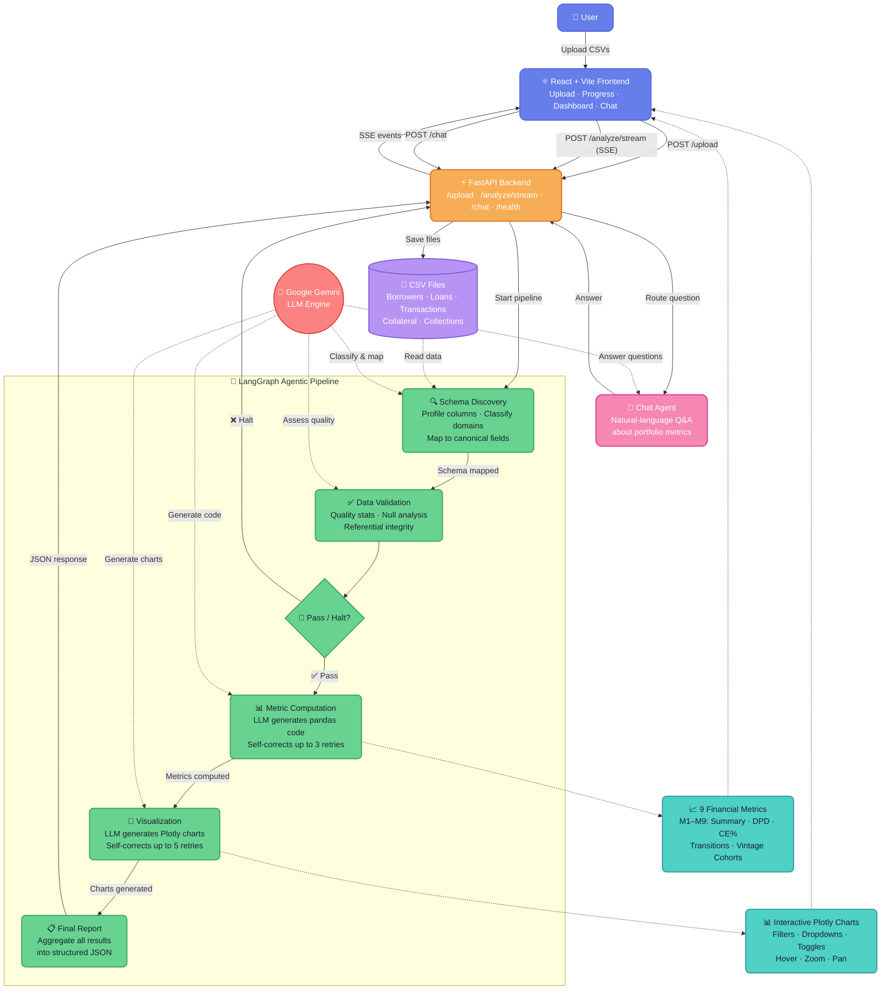

# Fintech-Agent — AI-Powered Loan Portfolio Analytics Dashboard

A full-stack agentic application that autonomously analyses loan portfolio CSV data from Indian NBFCs. Upload CSVs through a React web UI, watch real-time agent progress via Server-Sent Events, and get computed financial metrics with interactive Plotly charts — all powered by **Google Gemini + LangGraph**.

## What It Does

1. **Upload CSVs** via the React frontend (drag-and-drop or file picker)
2. **AI agents** autonomously discover file schemas, validate data quality, compute financial metrics, and generate visualisations — no manual column mapping needed
3. **Real-time progress** is streamed to the browser as each agent stage completes
4. **Results dashboard** displays computed metrics and interactive Plotly charts with filters, time-window selectors, and cohort controls
5. **Chat agent** lets you ask natural-language questions about the analysed portfolio data

## System Architecture



### Agent Nodes

| Agent | What it does |
|-------|-------------|
| **🔍 Schema Discovery** | Scans uploaded CSVs, profiles columns/dtypes/nulls, uses Gemini to classify file domains (loan/txn/borrower/collateral/collections) and map columns to canonical fields |
| **✅ Data Validation** | Loads full CSVs, computes quality stats (nulls, ranges, referential integrity); Gemini assesses pass / warn / halt |
| **📊 Metric Computation** | Gemini generates pandas code per metric; code executes on live DataFrames; self-corrects on failure (up to 3 retries) |
| **🎨 Visualization** | Gemini generates interactive Plotly chart code per metric; self-corrects on rendering errors (up to 5 retries) |
| **💬 Chat Agent** | Answers natural-language questions about computed metrics using full portfolio context |

## Supported Metrics

| ID | Metric | Chart Type | Interactive Controls |
|----|--------|------------|---------------------|
| M1 | Portfolio Summary — POS, active count, weighted avg rate & tenor | KPI Table | — |
| M2 | POS Distribution by DPD Bucket | Horizontal Bar | Hover, zoom |
| M3 | Collections Efficiency Time Series | Line + Area | Monthly/Quarterly toggle |
| M4 | CE% by DPD Bucket | Vertical Bar | Month selector dropdown |
| M5 | POS Transition Matrix (₹ Cr) | Heatmap | Period selector dropdown |
| M6 | POS Transition Matrix (%) | Heatmap | Period selector dropdown |
| M7 | Loan Count Transition Matrix | Heatmap | Period selector dropdown |
| M8 | Loan Count Transition Matrix (%) | Heatmap | Period selector dropdown |
| M9 | Vintage Cohort Repayment Curves | Multi-line | Cohort selector (All/Last 4/Last 8) |

> The LLM decides which metrics are feasible based on the files and columns you provide. Non-computable metrics are skipped with a reason.

## Key Features

- **Schema-agnostic**: Handles any CSV structure — the AI maps columns dynamically
- **Two datasets tested**: Medium (84K loans, 2.3M transactions, 5 files) and Large (3 files, different schema) — both work without code changes
- **Interactive charts**: All visualisations include Plotly interactivity — hover tooltips, zoom, pan, dropdown selectors, toggle buttons
- **Chat Q&A**: Ask questions like "What is the NPA rate?" or "Which cohort has the best repayment?" after analysis
- **Self-correcting agents**: Metric and visualization code is auto-fixed by the LLM on failure
- **Test suite**: 3 synthetic test datasets with ground truth, evaluated by an LLM judge (38/38 passing)

## Setup

### 1. Clone & install Python dependencies

```bash
cd Fintech-Agent/src
pip install -r requirements.txt
```

### 2. Configure API key

```bash
cp .env.example .env
# Edit .env and set your Gemini API key
# Get one from: https://aistudio.google.com/apikey
```

### 3. Start the backend

```bash
cd src
uvicorn api:app --reload --port 8000
```

### 4. Start the frontend

```bash
cd frontend
npm install
npm run dev
# Opens at http://localhost:5173
```

### 5. CLI usage (no frontend needed)

```bash
cd src
python run_agentic.py "../Medium Size data Set/"
python run_agentic.py "../Large data set/"
```

## API Endpoints

| Method | Path | Description |
|--------|------|-------------|
| `POST` | `/upload` | Upload one or more CSV files; returns saved paths and session_id |
| `POST` | `/analyze` | Run full pipeline; returns JSON result with session_id |
| `POST` | `/analyze/stream` | Run pipeline with SSE progress events + final result |
| `POST` | `/chat` | Ask a question about a previously analysed portfolio (requires session_id) |
| `GET` | `/health` | Liveness check |

## Project Structure

```
Fintech-Agent/
├── src/
│   ├── api.py                       # FastAPI — upload, analyze, chat, SSE streaming
│   ├── run_agentic.py               # CLI entry point
│   ├── requirements.txt
│   ├── agentic/
│   │   ├── graph.py                 # LangGraph StateGraph wiring
│   │   ├── state.py                 # TypedDict state definitions
│   │   ├── agent_schema.py          # Schema Discovery agent
│   │   ├── agent_validation.py      # Data Validation agent
│   │   ├── agent_metrics.py         # Metric Computation agent (LLM code-gen)
│   │   ├── agent_visualizations.py  # Plotly chart generation (LLM code-gen)
│   │   ├── agent_chat.py            # Chat Q&A agent
│   │   ├── llm_config.py            # Gemini model config
│   │   └── prompts.py               # All LLM prompt templates
│   └── core/
│       ├── models.py                # Pydantic models
│       ├── field_definitions.py
│       └── logger.py                # Coloured terminal logger
├── frontend/
│   ├── src/
│   │   ├── App.jsx                  # Main app — upload → stream → results → chat
│   │   ├── components/
│   │   │   ├── UploadArea.jsx       # Drag-and-drop CSV upload
│   │   │   ├── ProgressTracker.jsx  # Live SSE stage progress
│   │   │   ├── ResultsDashboard.jsx # Metrics + chart display
│   │   │   ├── MetricCard.jsx       # Individual metric card with chart iframe
│   │   │   └── ChatSidebar.jsx      # Chat panel for portfolio Q&A
│   │   └── index.css
│   ├── package.json
│   └── vite.config.js               # Proxies /api → localhost:8000
├── tests/
│   ├── generate_test_data.py        # Generates 3 synthetic test datasets
│   ├── run_tests.py                 # LLM-judged test runner (38/38 checks)
│   ├── test_case_1/                 # Clean: 10 loans, all current
│   ├── test_case_2/                 # Stressed: 10 loans, mixed DPD
│   └── test_case_3/                 # Edge cases: prepay, zero-pay, large/small
├── docs/                            # Domain knowledge & architecture docs
├── output_charts/                   # Generated Plotly HTML charts (gitignored)
├── uploads/                         # Uploaded CSV storage (gitignored)
└── .env.example
```

## Running Tests

```bash
cd tests
python run_tests.py
```

The test runner:
1. Generates 3 synthetic CSV datasets with known ground truth
2. Runs each through the full pipeline
3. Uses Gemini as an LLM judge to verify metric outputs against ground truth
4. Reports PASS/FAIL for 38 individual checks

## Configuration

| Variable | Default | Description |
|----------|---------|-------------|
| `GOOGLE_API_KEY` | — | Required — Gemini API key |
| `GEMINI_MODEL` | `gemini-2.0-flash` | Gemini model to use |

## Tech Stack

| Layer | Technology |
|-------|-----------|
| LLM | Google Gemini |
| Agent orchestration | LangGraph |
| LLM abstraction | LangChain |
| Backend API | FastAPI + SSE streaming |
| Data processing | pandas, numpy |
| Visualisation | Plotly (interactive, dark theme) |
| Frontend | React 18 + Vite |
| Styling | Custom CSS (dark theme) |